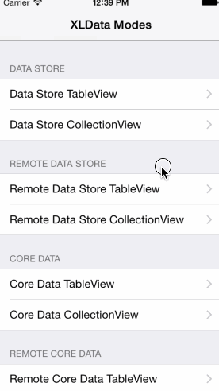

XLData
---------------

By [XMARTLABS](http://xmartlabs.com).

[](https://github.com/xmartlabs/XLData/blob/master/LICENSE)
[](https://github.com/xmartlabs/XLData/releases)

XLData provides an elegant and concise way to load and show data sets into table and collection views.

Purpose
--------------

You probably implement table/collection view controllers on a daily basis since a large part of an iOS app involves showing data in these views.

The data you need to show might be stored in memory, a Core Data db and often needs to be fetched from a json/xml API endpoint.  

But there is more than just showing the data: we may have to handle empty view state, errors, show "offline" status, add support for pagination, search, etc.

Whatever your source of data, XLData provides an elegant and concise solution to handle all challenges introduced above with minimal effort.



What XLData does
-------------------

* Show a data set stored in memory using a UITableView or a UICollectionView (works with both in-memory and Core Data data sets).
* Keeps track of data set changes on runtime to update the UITableView/UICollectionView on the fly (works with both in-memory and Core Data data sets).
* Provides a high-level abstraction to fetch a data set from a json/xml API endpoint. You can check additional details [here](#xldataloader).  
* Provides support for pagination and filtering.
* Provides an in-memory mechanism to store data sets. You can check additional details [here](#xldatastore).
* Manage empty state view showing a customizable empty state view when the data set is empty.
* Manage no internet connection view showing it when internet connection is not reachable.

Usage
-------------------

`XLData` supports many different scenarios from in-memory data sets to core data data sets and  remote sync of data sets. In this section we'll briefly explain how it can be used in typical scenarios. For a more detailed explanation please take a look at the [Examples ](/tree/master/Examples) folder.


####Data Store table/collection view controller

* Make your concrete view controller extends from `XLDataStoreController`

* Add sections (`XLDataSectionStore` instance) and then items to a section. Items can be of any type ;)
```obj-c
[self.dataStore addDataSection:[XLDataSectionStore dataSectionStoreWithTitle:@"Example"]];
[self.dataStore addDataItem:@{@"title": "Row title 1"}];
[self.dataStore addDataItem:@{@"title": "Row title 2"}];
```

* Return the cell:
```obj-c
-(UITableViewCell *)tableView:(UITableView *)tableView cellForRowAtIndexPath:(NSIndexPath *)indexPath
{
    UITableViewCell * cell = ....
    // retrieve data set item at indexPath
    NSDictionary * dataItem = [self.dataStore dataAtIndexPath:indexPath];
    // configure cell
    ...
    return cell;
}
```

####Data Store table/collection view controller sync with remote xml/json endpoint

* Make your concrete view controller extends from `XLRemoteDataStoreController`

* Set up the `dataLoader` property  by following these steps:
```obj-c
// instantiate a XLDataLoader instance and set `dataLoader` property with it. We can configure a convenient initializer to offset, limit and filter query parameters.
self.dataLoader =  [[XLDataLoader alloc] initWithDelegate:self
                                                URLString:@"/mobile/users.json"
                                          offsetParamName:@"offset"
                                           limitParamName:@"limit"
                                    searchStringParamName:@"filter"];
// configure how many items we want to fetch per request
self.dataLoader.limit = 4;
// configure the dataset path within the json result. In this example the dataset is in the json result's root.
self.dataLoader.collectionKeyPath = @"";
// configure any additional query parameter by providing key/value using the `parameter` property.
self.dataLoader.parameters[@"paramName1"] = paramValue1;
self.dataLoader.parameters[@"paramName2"] = paramValue2;
```

* Provide a `AFHTTPSessionManager` by implementing the following `XLDataLoaderDelegate` method:
```obj-c
-(AFHTTPSessionManager *)sessionManagerForDataLoader:(XLDataLoader *)dataLoader
```

* Return the cell:
```obj-c
-(UITableViewCell *)tableView:(UITableView *)tableView cellForRowAtIndexPath:(NSIndexPath *)indexPath
{
    UITableViewCell * cell = ....
    // retrieve data set item at indexPath
    NSDictionary * dataItem = [self.dataStore dataAtIndexPath:indexPath];
    // configure cell
    ...
    return cell;
}
```

* **Optional** Override a method to update the `XLDataStore` in a different way. By default XLData appends the fetched items to the last section of `XLDataStore`.
```obj-c
-(void)dataController:(UIViewController *)controller updateDataWithDataLoader:(XLDataLoader *)dataLoader`
```

####Core Data table/collection view controller

* Make your concrete view controller extends from `XLCoreDataController`.

* Set up `fetchedResultsController` property:
```obj-c
self.fetchedResultsController = [[NSFetchedResultsController alloc] initWithFetchRequest:[User getFetchRequest] managedObjectContext:[CoreDataStore mainQueueContext] sectionNameKeyPath:nil cacheName:nil];
```

* Return the cell:
```obj-c
-(UITableViewCell *)tableView:(UITableView *)tableView cellForRowAtIndexPath:(NSIndexPath *)indexPath
{
    UITableViewCell * cell = ...
    // retrieve data set item at indexPath
    NSManagedObject * dataItem = [self.fetchedResultsController objectAtIndexPath:indexPath];
    // configure cell
    ...
    return cell;
}
```


####Core Data table/collection view controller sync with remote xml/json endpoint

* Make your concrete view controller extends from `XLRemoteCoreDataController`

* Set up the `dataLoader` property by following these steps:
```obj-c
// instantiate a `XLDataLoader` instance and set `dataLoader` property with it. We can use a convenient initializer to offset, limit and filter query parameters.
self.dataLoader =  [[XLDataLoader alloc] initWithDelegate:self
                                                URLString:@"/mobile/users.json"
                                          offsetParamName:@"offset"
                                           limitParamName:@"limit"
                                    searchStringParamName:@"filter"];
// configure how many items we want to fetch per request
self.dataLoader.limit = 4;
// configure the dataset path within the json result. In this example the dataset is in the json result's root.
self.dataLoader.collectionKeyPath = @"";
// configure any additional query parameter by providing key/value using the `parameter` property.
self.dataLoader.parameters[@"paramName1"] = paramValue1;
self.dataLoader.parameters[@"paramName2"] = paramValue2;
```

* Provide a `AFHTTPSessionManager` by implementing the following `XLDataLoaderDelegate` method:
```obj-c
-(AFHTTPSessionManager *)sessionManagerForDataLoader:(XLDataLoader *)dataLoader
```

* Return the cell:
```obj-c
-(UITableViewCell *)tableView:(UITableView *)tableView cellForRowAtIndexPath:(NSIndexPath *)indexPath
{
    UITableViewCell * cell = ...
    // retrieve data set item at indexPath
    NSManagedObject * dataItem = [self.fetchedResultsController objectAtIndexPath:indexPath];
    // configure cell
    ...
    return cell;
}
```

* You must override the following method in order to syncronize the  dataset fetched by the DataLoader with the Core Data dataset.
```obj-c
-(void)dataController:(UIViewController *)controller updateDataWithDataLoader:(XLDataLoader *)dataLoader`
```

###Customization

#### How to set up an empty state view

`XLDataStoreController` and `XLCoreDataController` expose `emptyDataSetView` property. We can set up a UIView either through storyboard (IBOutlet) or programatically.

#### How to set up a networking status view

`XLRemoteDataStoreController` and `XLRemoteCoreDataController` expose 'networkStatusView' property. We can set up a UIView either through storyboard (IBOutlet) or programatically.

Take a look at the examples to see how those properties work.

How it works?
-------------------

In this section we will introduce two relevant abstractions that will help you have a better understanding of the library design and behaviour.

###XLDataStore

As you may already know, XLData is able to show a data set that is stored in-memory or in a Core Data db.

In order to show a Core Data data set we use the well-known class `NSFetchedResultsController`, making `XLCoreDataController` conforms to the  `NSFetchedResultsControllerDelegate` protocol and get notified each time a new `NSManagedObjectModel` instance is added, deleted or modified within a `NSManagedObjectContext`.

Since `NSFetchedResultsControllerDelegate` works well and is popular among the community, we designed a similar pattern for in-memory data sets.

In order to accomplish that, `XLDataStoreController` store the in-memory data sets within a `XLDataStore` instance and conforms to the `XLDataStoreDelegate` to get notified whenever the in-memory data set is modified either by adding/removing a new item or section (`XLDataStoreSection`).

`XLDataStoreDelegate` is analog to `NSFetchedResultsControllerDelegate` but it works with in-memory data sets. `XLDataStore` contains `XLDataStoreSection` instances which are able to store any kind of object. Cool right?

BTW `XLDataStore` and its delegate are encapsulated and can be used independently and not just alongside `XLData` controllers.

###XLDataLoader

As we have explained previously, `XLData` is able to fetch data from an API endpoint.
To do so we define `XLDataLoader` which exposes several properties in order to support any kind of json format.

This are some properties exposed by `XLDataLoader`:

```obj-c
@property NSUInteger offset;
@property NSUInteger limit;
@property NSString * searchString;
@property (nonatomic) NSMutableDictionary * parameters;
@property (nonatomic) NSString * collectionKeyPath;
@property (readonly) NSDictionary * loadedData;
@property (readonly) NSArray * loadedDataItems;
```

You may be interested in converting each fetched item to a more appropiate model, for example using `Mantle` or `JSONModel`.You can do so by implementing the following `XLDataLoaderDelegate` method:

```obj-c
-(id)dataLoader:(XLDataLoader *)dataLoader convertJsonItemToModelObject:(id)item;
```

This method will be called for each item fetched from the endpoint.

BTW `XLDataLoader` and its delegate can be used independently and not just alongside `XLData` controllers.

How to run XLData examples
---------------------------------

1. Clone the repository `git@github.com:xmartlabs/XLData.git`. Optionally you can fork the repository and clone it from your own github account, this approach would be better if you want to contribute.
2. Move to project root folder.
3. Install example project cocoapod dependencies by running on terminal `pod install`.
4. Open XLData workspace using XCode and run the project. Enjoy!

Installation
--------------------------

The easiest way to use XLData in your app is via [CocoaPods](http://cocoapods.org/ "CocoaPods").

1. Add the following line in the project's Podfile file: `pod 'XLData', '~> 1.0'`.

2. Run the command `pod install` from the Podfile folder directory.

In order to avoid unnecessary dependencies, `XLData` is divided into standalone sub-modules (with different dependencies each) using CocoaPods subspecs:

* `XLData/DataStore` includes in-memory related library classes.
* `XLData/CoreData` includes Core Data related library classes (depends on Core Data framework).
* `XLData/RemoteCoreData` includes Core Data related library classes and networking classes (depends on AFNetworking library and Core Data framework).
* `XLData/RemoteDataStore` includes in-memory related library classes and networking classes (depends on AFNetworking library).

Requirements
-----------------------------

* ARC
* iOS 8.0 and above


Release Notes
--------------
Version 1.0.2

* Bug fixes.
* Improve examples.

Version 1.0.1

* Fix podspec minor issue.

Version 1.0.0

* Initial release

Author
-----------------

[Martin Barreto](https://www.github.com/mtnBarreto "Martin Barreto Github") ([@mtnBarreto](http://twitter.com/mtnBarreto "@mtnBarreto"))


Contact
----------------

Any suggestion or question? Please create a Github issue or reach me out.
